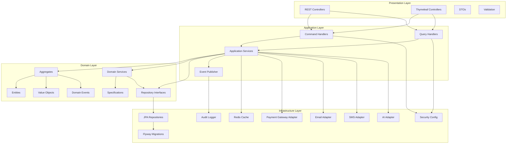

# Component Diagram

## Application Components

## Component Descriptions

### Presentation Layer
- **REST Controllers**: Handle HTTP requests, validate input, return responses
- **Thymeleaf Controllers**: Render HTML views, handle form submissions
- **DTOs**: Data transfer objects for API contracts
- **Validation**: Request validation using Spring Validation

### Application Layer
- **Command Handlers**: Handle write operations (CQRS)
- **Query Handlers**: Handle read operations (CQRS)
- **Application Services**: Orchestrate use cases, manage transactions
- **Event Publisher**: Publish domain events to message bus

### Domain Layer
- **Aggregates**: Consistency boundaries (Ledger, Journal, Account)
- **Entities**: Domain objects with identity
- **Value Objects**: Immutable values (Money, Currency, AccountNumber)
- **Domain Events**: Business events (PaymentReceived, EntryPosted)
- **Domain Services**: Business logic that doesn't belong to entities
- **Repository Interfaces**: Contracts for data access
- **Specifications**: Business rules encapsulation

### Infrastructure Layer
- **JPA Repositories**: PostgreSQL implementation of repositories
- **Flyway Migrations**: Database schema versioning
- **Security Config**: JWT authentication, authorization
- **Payment Gateway Adapter**: External payment system integration
- **Email Adapter**: Email service integration
- **SMS Adapter**: SMS service integration
- **AI Adapter**: AI service integration
- **Redis Cache**: Caching implementation
- **Audit Logger**: Audit trail implementation
