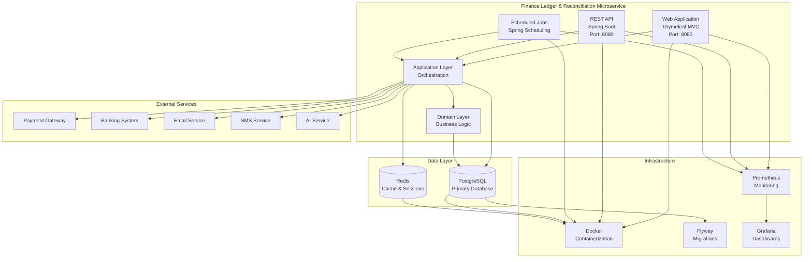

# Container Diagram

## System Containers

## Container Descriptions

### Web Application
- **Technology**: Spring Boot with Thymeleaf MVC
- **Port**: 8080
- **Responsibility**: Provides user interface for finance operations
- **Features**: Account management, journal entry forms, report viewing

### REST API
- **Technology**: Spring Boot REST
- **Port**: 8080
- **Responsibility**: Provides programmatic access for external systems
- **Features**: Payment processing, webhook endpoints, data export
- **Security**: JWT authentication, role-based authorization

### Scheduled Jobs
- **Technology**: Spring Scheduling
- **Responsibility**: Executes periodic tasks
- **Features**: Daily reconciliation, report generation, data cleanup

### Application Layer
- **Technology**: Spring Services
- **Responsibility**: Orchestrates use cases
- **Features**: Command/query handling, event publishing, transaction management

### Domain Layer
- **Technology**: Pure Java (no Spring dependencies)
- **Responsibility**: Core business logic
- **Features**: Aggregates, entities, value objects, domain services

### PostgreSQL
- **Version**: 15+
- **Responsibility**: Primary data store
- **Features**: ACID transactions, constraints, indexes
- **Migration**: Flyway

### Redis
- **Version**: 7+
- **Responsibility**: Cache and session store
- **Features**: Distributed caching, rate limiting, session management
