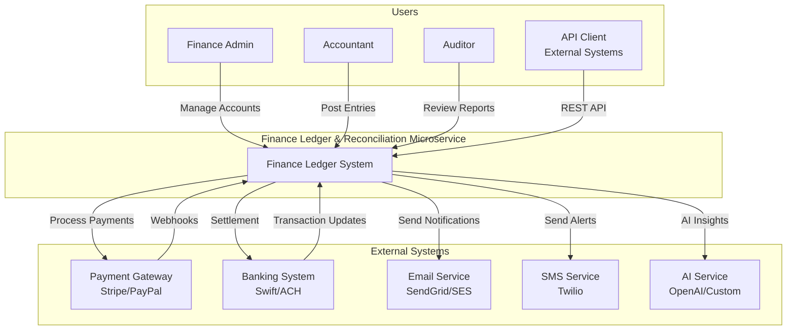

# Context Diagram

## System Context
The Finance Ledger & Reconciliation microservice interacts with external systems and users.

## Context Description

### Users
- **Finance Admin**: Manages chart of accounts, users, permissions, system configuration
- **Accountant**: Posts journal entries, reconciles transactions, generates reports
- **Auditor**: Reviews audit logs, financial statements, compliance reports
- **API Client**: External systems integrating via REST API

### External Systems
- **Payment Gateway**: Processes payments (Stripe, PayPal), sends webhooks
- **Banking System**: Handles settlements, bank transfers (Swift, ACH)
- **Email Service**: Delivers notifications, reports, receipts (SendGrid, SES)
- **SMS Service**: Sends critical alerts (Twilio)
- **AI Service**: Provides anomaly detection, forecasting (OpenAI, Custom)

### Core System
The Finance Ledger & Reconciliation Platform is the central accounting engine that:
- Maintains double-entry ledger
- Processes payments and webhooks
- Reconciles transactions
- Generates financial reports
- Provides audit trail
- Delivers notifications and receipts
