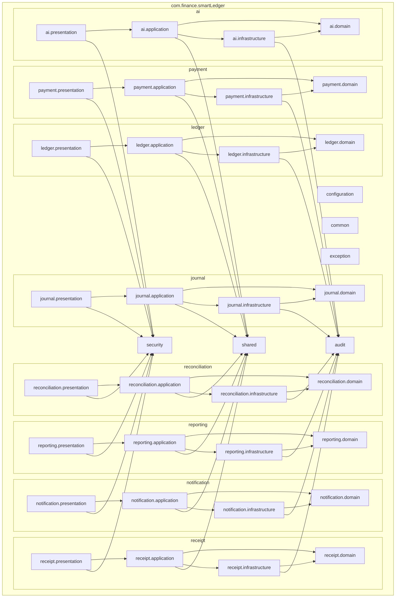

# Package Diagram

## Module Package Structure

## Package Structure Details

### Root Packages
- **configuration**: Spring configuration, beans, profiles
- **common**: Shared utilities, constants, enums
- **exception**: Custom exceptions, global exception handler
- **security**: Security configuration, JWT, permissions
- **audit**: Audit logging, change tracking
- **shared**: Shared kernel (base entities, value objects)

### Module Packages (each module has 4 layers)
- **domain**: Domain model (entities, aggregates, value objects, domain events, repository interfaces)
- **application**: Application services, command/query handlers, DTOs
- **infrastructure**: Repository implementations, external adapters, persistence
- **presentation**: Controllers, views, API contracts

### Module Independence
- Each module can be extracted into a microservice
- Modules communicate via application events and interfaces
- Domain layer has no dependencies on other modules
- Shared kernel provides common infrastructure
