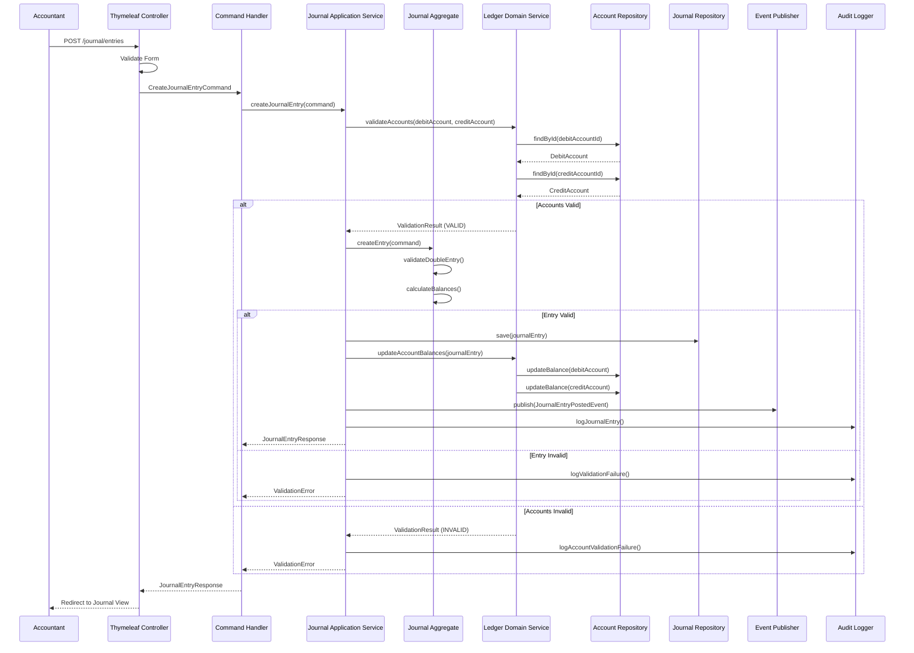

# Sequence Diagram - Journal Posting

## Journal Entry Posting Flow

## Journal Posting Steps

1. **Form Validation**: Thymeleaf controller validates journal entry form
2. **Command Creation**: CreateJournalEntryCommand created
3. **Account Validation**: Ledger service validates debit and credit accounts exist
4. **Journal Entry Creation**: Journal aggregate creates entry with double-entry validation
5. **Balance Calculation**: Calculate debit and credit balances
6. **Persistence**: Save journal entry to database
7. **Balance Update**: Update account balances in ledger
8. **Event Publishing**: Publish JournalEntryPostedEvent for notifications
9. **Audit Logging**: Log journal entry for compliance

## Key Design Decisions
- Journal aggregate enforces double-entry rules
- Ledger service validates account existence and balances
- Immutable journal entries ensure audit trail
- Domain events trigger trial balance updates
- Account balances updated atomically with journal entry
