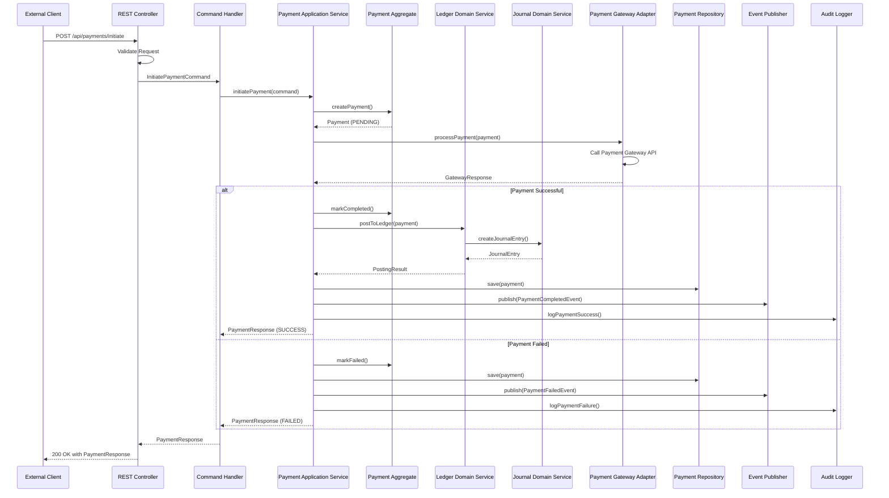

# Sequence Diagram - Payment Processing

## Payment Flow

## Payment Processing Steps

1. **Request Validation**: REST controller validates payment request
2. **Command Creation**: Command handler creates InitiatePaymentCommand
3. **Payment Creation**: Application service creates Payment aggregate in PENDING state
4. **Gateway Processing**: Payment gateway adapter processes payment via external API
5. **Success Path**:
   - Payment marked as COMPLETED
   - Ledger service posts double-entry to ledger
   - Journal service creates immutable journal entry
   - Payment persisted to database
   - PaymentCompletedEvent published
   - Audit log updated
6. **Failure Path**:
   - Payment marked as FAILED
   - Payment persisted to database
   - PaymentFailedEvent published
   - Audit log updated
7. **Response**: Return payment response to client

## Key Design Decisions
- Payment aggregate ensures consistency of payment state
- Ledger and Journal services handle double-entry posting
- Domain events trigger notifications and reconciliation
- Audit trail maintained for compliance
- Gateway adapter isolates external payment system
