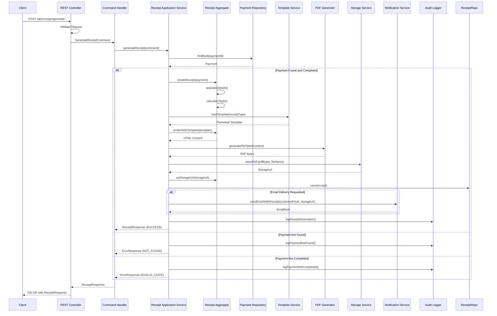

# Sequence Diagram - Receipt Generation

## Receipt Generation Flow

## Receipt Generation Steps

1. **Request Validation**: REST controller validates receipt generation request
2. **Payment Lookup**: Fetch payment by ID
3. **Receipt Creation**: Receipt aggregate creates receipt with payment details
4. **Template Loading**: Load appropriate Thymeleaf template
5. **HTML Rendering**: Render receipt with template
6. **PDF Generation**: Convert HTML to PDF
7. **Storage**: Store PDF in cloud storage
8. **Email Delivery**: Send receipt via email if requested
9. **Audit Logging**: Log receipt generation for compliance

## Key Design Decisions
- Receipt aggregate encapsulates receipt logic
- Thymeleaf templates for flexible receipt design
- PDF generation for professional receipts
- Cloud storage for persistent receipt storage
- Email delivery for customer convenience
- Audit trail for compliance
