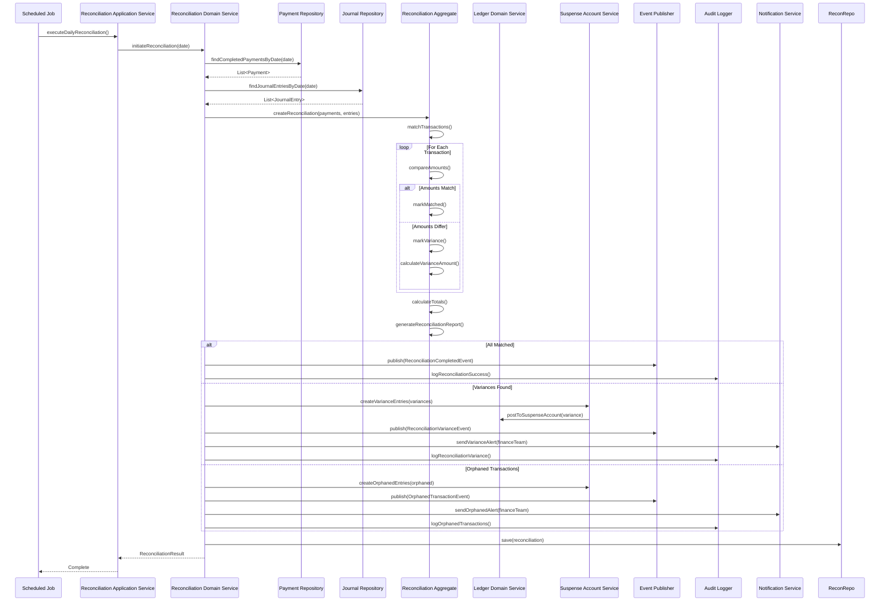

# Sequence Diagram - Reconciliation

## Reconciliation Process Flow

## Reconciliation Steps

1. **Scheduled Execution**: Daily job triggers reconciliation
2. **Data Retrieval**: Fetch payments and journal entries for date
3. **Matching**: Compare payment amounts with journal entries
4. **Variance Detection**: Identify amount differences
5. **Report Generation**: Create reconciliation report
6. **Variance Handling**: Post variances to suspense account
7. **Orphan Handling**: Handle unmatched transactions
8. **Notification**: Alert finance team of issues
9. **Audit Logging**: Log reconciliation results

## Key Design Decisions
- Scheduled jobs ensure daily reconciliation
- Reconciliation aggregate encapsulates matching logic
- Variances automatically posted to suspense account
- Notifications alert finance team to issues
- Audit trail maintained for compliance
