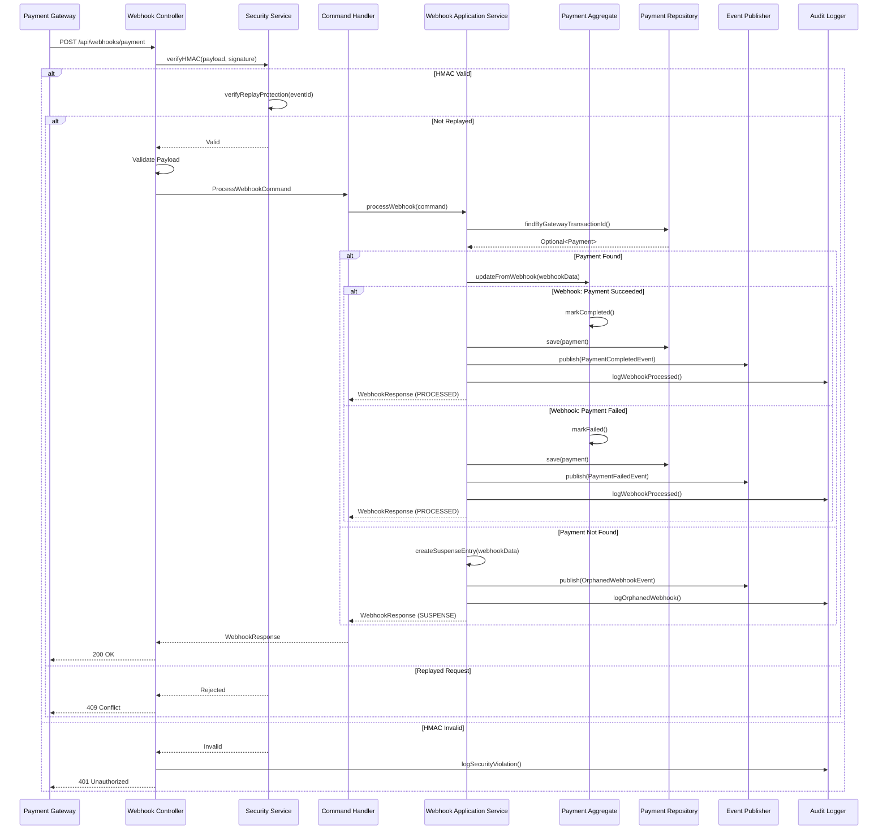

# Sequence Diagram - Webhook Handling

## Webhook Processing Flow

## Webhook Processing Steps

1. **HMAC Verification**: Security service verifies webhook signature
2. **Replay Protection**: Check if webhook was already processed
3. **Payload Validation**: Validate webhook payload structure
4. **Payment Lookup**: Find payment by gateway transaction ID
5. **Payment Update**: Update payment aggregate based on webhook status
6. **Event Publishing**: Publish domain events for notifications
7. **Audit Logging**: Log all webhook processing for compliance
8. **Suspense Handling**: Create suspense entry for orphaned webhooks

## Key Design Decisions
- HMAC verification ensures webhook authenticity
- Replay protection prevents duplicate processing
- Orphaned webhooks go to suspense account for manual review
- Audit trail maintained for all webhook events
