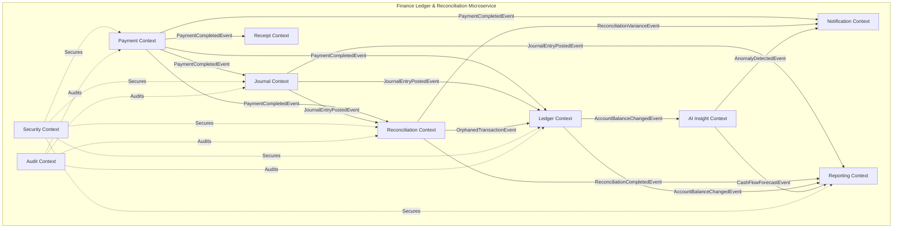

# Phase 0: Architecture - Bounded Contexts

## Overview
Bounded Contexts are distinct parts of the domain logic, each with its own ubiquitous language, model, and rules. They define the boundaries within which a particular domain model applies. This system is organized into 10 bounded contexts, each corresponding to an independent module.

## Bounded Context Map



## Context Definitions

### 1. Payment Context

**Responsibility**: Handle payment processing, gateway integration, and webhook handling.

**Core Concepts**:
- Payment
- Payment Gateway
- Webhook
- Payment Status (PENDING, COMPLETED, FAILED, CANCELLED)
- Gateway Transaction ID

**Ubiquitous Language**:
- "Initiate a payment"
- "Process webhook"
- "Verify payment status"
- "Handle payment failure"

**Key Domain Events**:
- PaymentInitiated
- PaymentCompleted
- PaymentFailed
- WebhookReceived

**Dependencies**:
- External: Payment Gateway (Stripe, PayPal)
- Internal: Ledger (for posting), Journal (for entries), Receipt (for generation), Notification (for alerts)

**Extraction Potential**: High - can be extracted as independent microservice handling all payment operations

---

### 2. Ledger Context

**Responsibility**: Maintain chart of accounts, account balances, and ensure accounting equation integrity.

**Core Concepts**:
- Chart of Accounts
- Account
- Account Type (ASSET, LIABILITY, EQUITY, REVENUE, EXPENSE)
- Account Balance
- Accounting Equation (Assets = Liabilities + Equity)

**Ubiquitous Language**:
- "Chart of accounts"
- "Account balance"
- "Debit/Credit"
- "Account type"

**Key Domain Events**:
- AccountCreated
- AccountActivated
- AccountDeactivated
- AccountBalanceChanged

**Dependencies**:
- External: None
- Internal: Reporting (for balance data), AI (for analysis)

**Extraction Potential**: Medium - core accounting engine, may need tight coupling with Journal context

---

### 3. Journal Context

**Responsibility**: Maintain immutable journal entries, enforce double-entry rules, and handle posting logic.

**Core Concepts**:
- Journal Entry
- Journal Entry Line (Debit/Credit)
- Entry Number
- Posting
- Double-Entry Validation

**Ubiquitous Language**:
- "Journal entry"
- "Post entry"
- "Debit/Credit lines"
- "Entry validation"

**Key Domain Events**:
- JournalEntryCreated
- JournalEntryPosted
- JournalEntryReversed

**Dependencies**:
- External: None
- Internal: Ledger (for account validation), Reconciliation (for matching), Reporting (for trial balance)

**Extraction Potential**: Medium - closely tied to Ledger context but can operate independently

---

### 4. Reconciliation Context

**Responsibility**: Match payments with journal entries, detect variances, handle orphaned transactions.

**Core Concepts**:
- Reconciliation
- Reconciliation Report
- Variance
- Orphaned Transaction
- Suspense Account
- Matching Algorithm

**Ubiquitous Language**:
- "Reconcile transactions"
- "Detect variance"
- "Orphaned transaction"
- "Suspense account"

**Key Domain Events**:
- ReconciliationInitiated
- ReconciliationCompleted
- ReconciliationVarianceDetected
- OrphanedTransactionFound

**Dependencies**:
- External: None
- Internal: Payment (for payment data), Journal (for entry data), Ledger (for suspense posting), Notification (for alerts)

**Extraction Potential**: High - can be extracted as independent microservice for reconciliation operations

---

### 5. Reporting Context

**Responsibility**: Generate financial reports (Balance Sheet, Income Statement, Cash Flow, Trial Balance).

**Core Concepts**:
- Balance Sheet
- Income Statement
- Cash Flow Statement
- Trial Balance
- Report Period
- Report Generation

**Ubiquitous Language**:
- "Generate balance sheet"
- "Trial balance"
- "Financial statements"
- "Report period"

**Key Domain Events**:
- ReportGenerated
- ReportRequested

**Dependencies**:
- External: None
- Internal: Ledger (for account data), Journal (for entry data), AI (for forecasts)

**Extraction Potential**: High - can be extracted as independent microservice for reporting

---

### 6. Security Context

**Responsibility**: Handle authentication, authorization, role management, and permission enforcement.

**Core Concepts**:
- User
- Role
- Permission
- Authentication (JWT)
- Authorization (RBAC)
- Role Hierarchy

**Ubiquitous Language**:
- "Authenticate user"
- "Authorize action"
- "Role and permission"
- "Access control"

**Key Domain Events**:
- UserAuthenticated
- UserCreated
- RoleAssigned
- PermissionGranted

**Dependencies**:
- External: None
- Internal: All contexts (cross-cutting concern)

**Extraction Potential**: Low - cross-cutting concern that secures all contexts

---

### 7. Audit Context

**Responsibility**: Maintain audit trail, log all changes, support compliance reporting.

**Core Concepts**:
- Audit Log
- Audit Entry
- Change Tracking
- Before/After Values
- Audit Trail
- Compliance Report

**Ubiquitous Language**:
- "Audit log"
- "Change tracking"
- "Audit trail"
- "Compliance"

**Key Domain Events**:
- AuditEntryCreated
- AuditReportGenerated

**Dependencies**:
- External: None
- Internal: All contexts (cross-cutting concern)

**Extraction Potential**: Low - cross-cutting concern that audits all contexts

---

### 8. Notification Context

**Responsibility**: Send email and SMS notifications, manage delivery status, handle templates.

**Core Concepts**:
- Notification
- Email Notification
- SMS Notification
- Notification Template
- Delivery Status
- Notification Preference

**Ubiquitous Language**:
- "Send notification"
- "Email template"
- "Delivery status"
- "Notification preference"

**Key Domain Events**:
- NotificationSent
- NotificationFailed
- NotificationDelivered

**Dependencies**:
- External: Email Service (SendGrid, SES), SMS Service (Twilio)
- Internal: All contexts (cross-cutting concern)

**Extraction Potential**: High - can be extracted as independent microservice for notifications

---

### 9. Receipt Context

**Responsibility**: Generate PDF receipts, manage receipt templates, handle delivery.

**Core Concepts**:
- Receipt
- Receipt Template
- PDF Generation
- Receipt Storage
- Receipt Delivery

**Ubiquitous Language**:
- "Generate receipt"
- "Receipt template"
- "PDF generation"
- "Receipt delivery"

**Key Domain Events**:
- ReceiptGenerated
- ReceiptDelivered
- ReceiptFailed

**Dependencies**:
- External: Cloud Storage (for PDF storage)
- Internal: Payment (for payment data), Notification (for email delivery)

**Extraction Potential**: High - can be extracted as independent microservice for receipt generation

---

### 10. AI Insight Context

**Responsibility**: Detect anomalies, forecast cash flow, generate recommendations, provide insights.

**Core Concepts**:
- Anomaly Detection
- Cash Flow Forecast
- Financial Recommendation
- Insight
- Confidence Score
- AI Model

**Ubiquitous Language**:
- "Detect anomaly"
- "Cash flow forecast"
- "Financial recommendation"
- "Confidence score"

**Key Domain Events**:
- AnomalyDetected
- CashFlowForecastGenerated
- RecommendationGenerated
- InsightCreated

**Dependencies**:
- External: AI Service (OpenAI, Custom)
- Internal: Ledger (for financial data), Reporting (for report data), Notification (for alerts)

**Extraction Potential**: High - can be extracted as independent microservice for AI operations

---

## Context Relationships

### Upstream-Downstream Relationships

**Payment Context** (Upstream) → **Ledger Context** (Downstream)
- Payment posts to ledger when completed
- Ledger depends on payment data for account balances

**Journal Context** (Upstream) → **Ledger Context** (Downstream)
- Journal entries update ledger balances
- Ledger depends on journal for transaction history

**Payment Context** (Upstream) → **Reconciliation Context** (Downstream)
- Reconciliation matches payments with journal entries
- Reconciliation depends on payment data

**Journal Context** (Upstream) → **Reconciliation Context** (Downstream)
- Reconciliation matches journal entries with payments
- Reconciliation depends on journal entry data

### Shared Kernel

**Security Context** and **Audit Context** are shared kernels that provide cross-cutting concerns to all other contexts. They are not extracted as microservices but provide essential services to all modules.

### Anti-Corruption Layer

**Payment Context** includes an anti-corruption layer to translate external payment gateway models into the internal domain model, isolating the system from external API changes.

## Context Mapping Strategy

### Customer/Supplier
- **Payment Context** is a supplier to Ledger, Journal, Receipt, and Notification contexts
- **AI Context** is a supplier to Reporting and Notification contexts

### Open Host Service
- **Reporting Context** provides an open host service for generating reports
- **Notification Context** provides an open host service for sending notifications

### Partnership
- **Ledger Context** and **Journal Context** have a partnership relationship due to tight coupling in double-entry bookkeeping

### Conformist
- **Security Context** and **Audit Context** are conformists that follow industry standards for security and auditing

## Module Structure

Each bounded context corresponds to a module with the following structure:

```
com.finance.smartLedger.{context}
├── domain          # Domain model (entities, aggregates, value objects, domain events)
├── application     # Application services, command/query handlers, DTOs
├── infrastructure  # Repository implementations, external adapters
└── presentation    # Controllers, views, API contracts
```

This structure ensures each context is independently extractable into a microservice while maintaining clear architectural boundaries.
